### 功能
```
1.支持千万级用户同时在线。
2.可达每日亿级的消息实时处理能力。
3.传输数据自主加密，安全无忧。
4.信息传递高效稳定，毫秒级消息延迟。
5.SDK集成简单，API灵活，轻松接入。
6.可支持智能标签分类用户的能力。
7.多维度精准推送，提高业务指标。
8.可用于媒体社交、游戏娱乐、直播互动等各种业务场景。
9.具备完善的监控体系和消息回溯能力，消息推送效果实时跟踪分析。
```
### 架构图
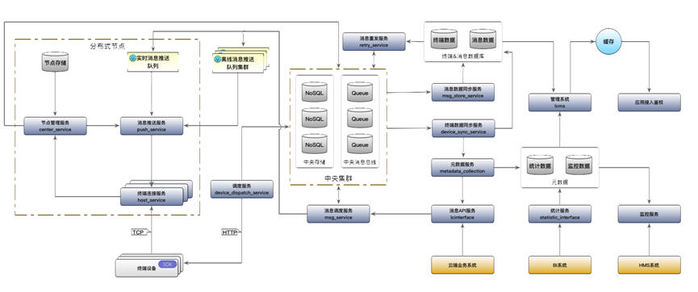
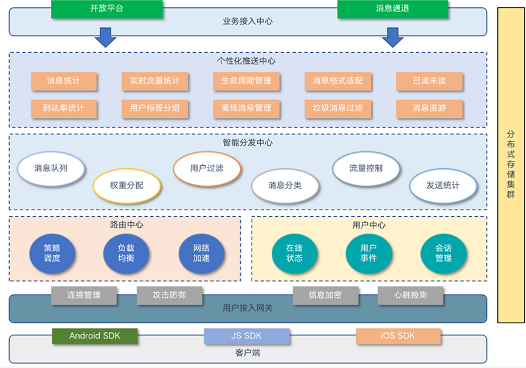

###展示
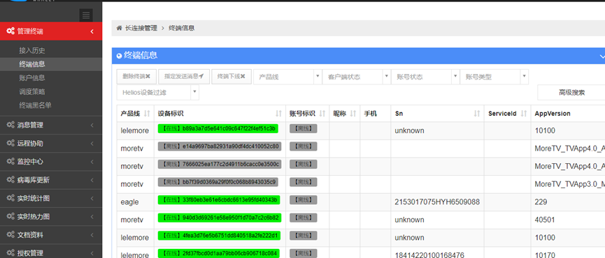
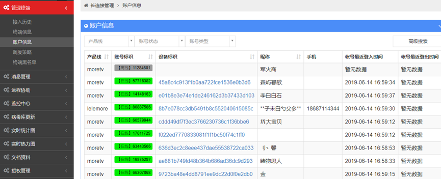
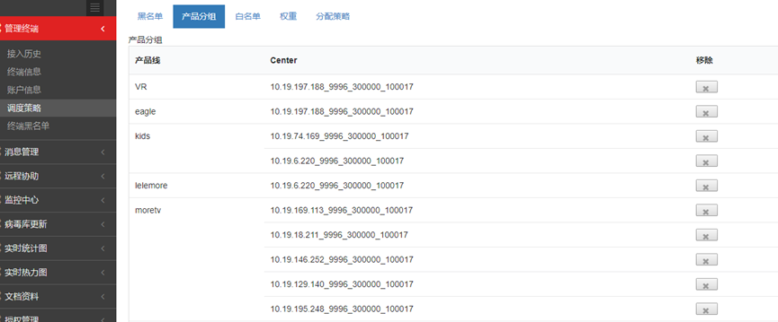
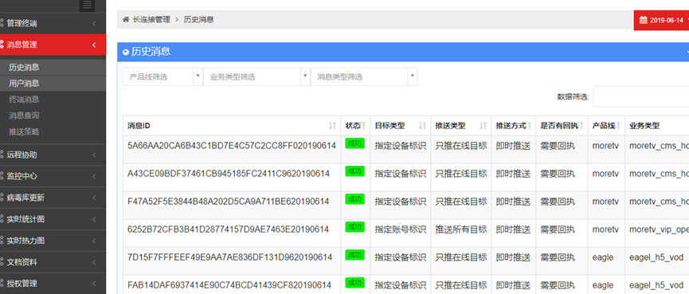
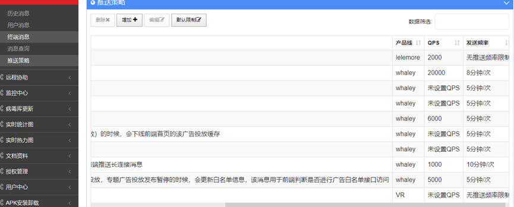
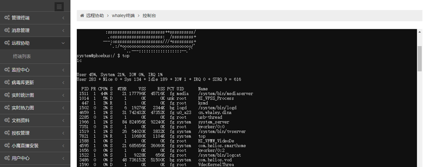
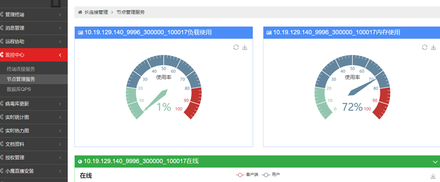
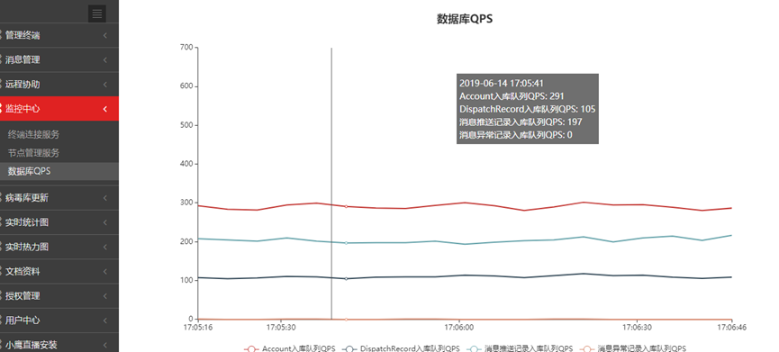
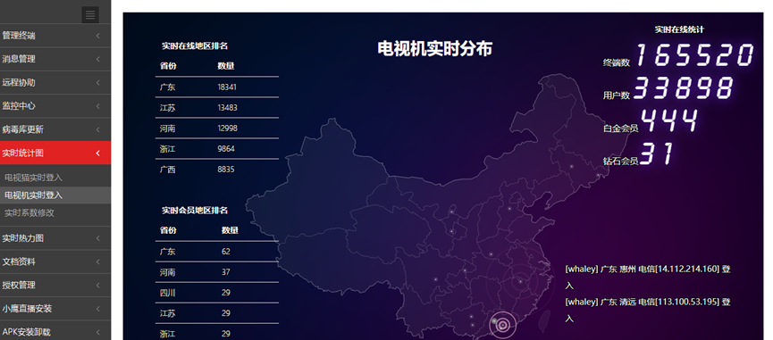
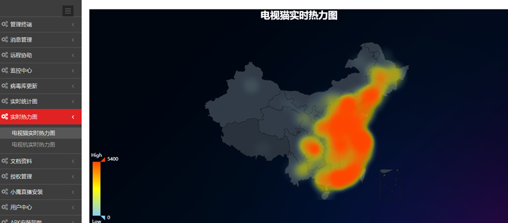
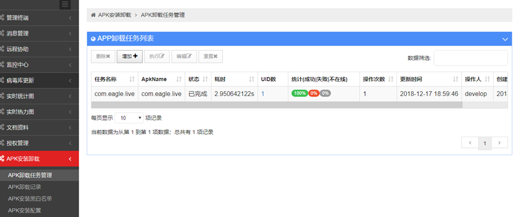
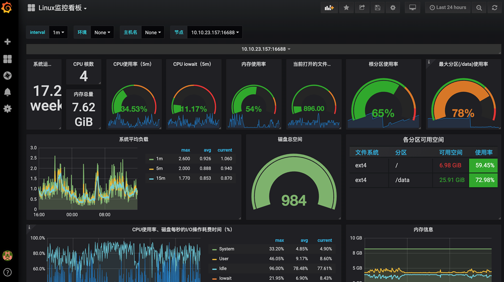